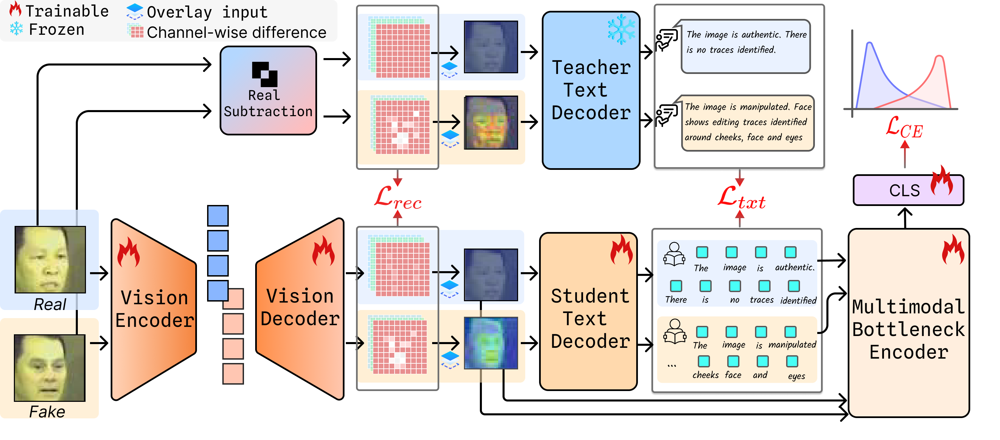

  <h1 align="center">XB-DFD: Explanation Bottleneck Deepfake Detection Models</h1>

  

<h2>🥇Abstract</h2>

Deepfakes have emerged as a critical global concern—enabling creativity while amplifying misinformation. Although many detection strategies aim to improve cross-domain generalization, most operate as black boxes, limiting interpretability and trust. Some recent approaches attempt manipulation localization via textual prompts and Grad-CAM visualizations; however, they often rely on rigid instructional shortcuts and shallow embedding-space heatmaps, constraining practical reliability.  
In high-stakes domains—law enforcement, judicial forensics, and political decision-making—current systems rarely provide transparent, white-box reasoning. To address this, we introduce <b>e<u>X</u>planation <u>B</u>ottleneck <u>D</u>eep<u>F</u>ake <u>D</u>etection (XB-DFD)</b>, designed to extract <b>facial forgery artifacts</b> and produce <b>concept-based textual explanations</b>. XB-DFD couples a forgery-targeted supervisory objective with an explanation bottleneck to improve <b>out-of-domain (OOD)</b> generalization, delivering both visual and textual evidence that fosters transparency and trustworthy forensic decision-making.

<h2>📝TODOs</h2>
<ul>
  <li>[x] Training + Evaluation Code</li>
  <li>[x] Model Weights</li>
  <li>[x] Inference Code</li>
</ul>

We have released the training, evaluation, and inference code for image-based explanation generation. See the <a href="#inference---demo">inference section</a> for details.

<h2>🚀Installation</h2>
<pre><code># Using pip
pip install -r requirements.txt
</code></pre>

<h2>📂Dataset Structure and Pre-processing</h2>

The pre-processed dataset structure follows <a href="https://github.com/SCLBD/DeepfakeBench">DeepfakeBench</a>. Use the same splits and preprocessing pipeline to reproduce results.

<pre><code>datasets/
│
├── CelebDF/
│   ├── train/
│   ├── val/
│   └── test/
│
├── DFDC/
│   ├── train/
│   ├── val/
│   └── test/
│
└── metadata/
    └── annotations.json
</code></pre>

<h2>🤖Training &amp; Evaluation</h2>
<h3>Training - BLIP</h3>
<pre><code>bash train_blip.sh   # start BLIP-based training
</code></pre>
<h3>Training - LLaVA</h3>
<pre><code>bash train_llava.sh  # start LLaVA-based training
</code></pre>
<h3>Evaluation - Standard, for downloading pretrained weights visit: https://huggingface.co/XB-DF/XB-DF/tree/main/checkpoints</h3>

To evaluate on supported datasets:

<pre><code>bash val.sh
</code></pre>

<h2 id="inference---demo">😎Inference - Demo</h2>

Generate visual and textual explanations for a given image:

<pre><code>bash inference.sh
</code></pre>

The model outputs both:

<ul>
  <li><b>Visual explanations</b> highlighting forgery artifacts.</li>
  <li><b>Textual explanations</b> describing manipulation patterns.</li>
</ul>

<b>Example Output:</b>

<pre><code>Visual Explanation: ./outputs/sample_explained.png
Textual Explanation: "Subtle inconsistencies near the mouth and eyes indicate potential lip-swap manipulation."
</code></pre>

<h2>🤝Acknowledgements</h2>
<ul>
  <li><a href="https://github.com/SCLBD/DeepfakeBench">DeepfakeBench</a></li>
  <li><a href="https://github.com/salesforce/BLIP">BLIP</a></li>
  <li><a href="https://github.com/haotian-liu/LLaVA">LLaVA</a></li>
  <li><a href="https://github.com/yshinya6/xbm">XBM</a></li>
</ul>